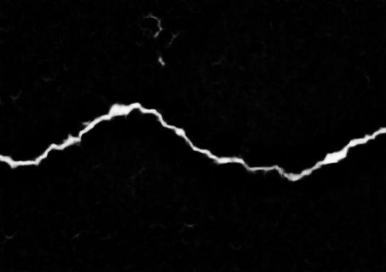
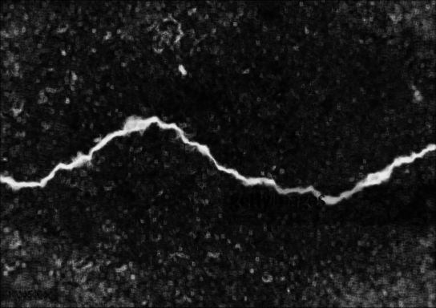
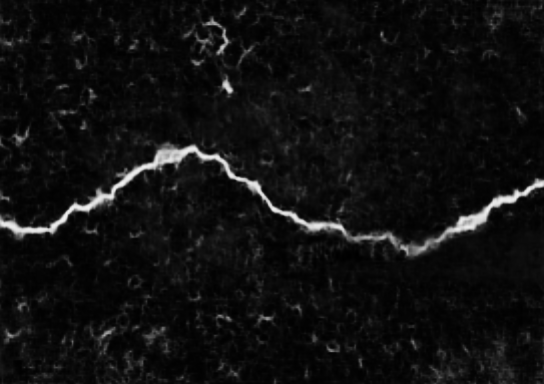
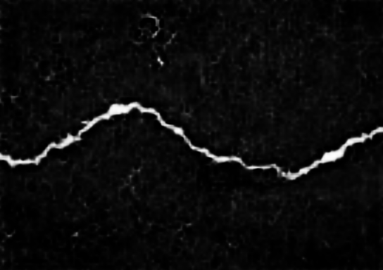
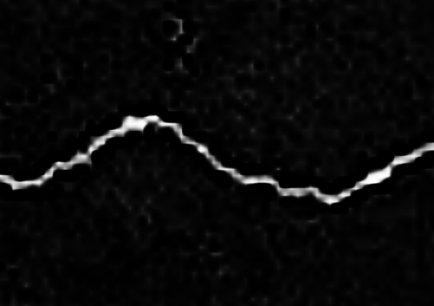
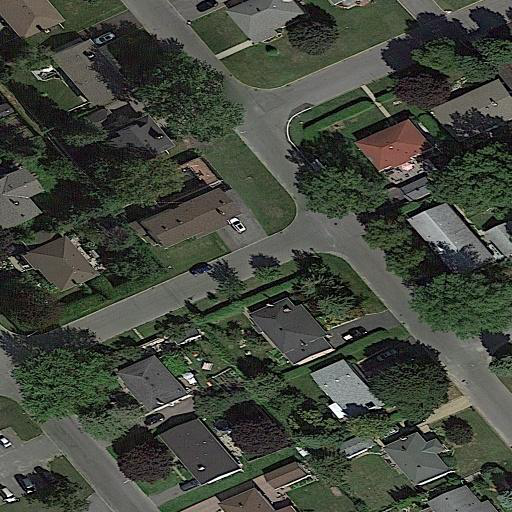
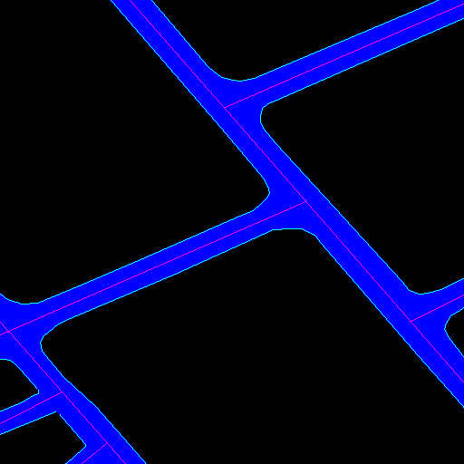

# DeepSegmentor
A Pytorch implementation of DeepCrack and RoadNet projects.

### 1.Datasets

 - [Crack Detection Dataset](https://github.com/yhlleo/DeepCrack)
 - [Multi-task Road Detection Dataset](https://github.com/yhlleo/RoadNet)

Please download the corresponding dataset and prepare it by following the [guidance](./datasets/README.md). 

### 2.Installation

We provide an user-friendly configuring method via [Conda](https://docs.conda.io/en/latest/) system, and you can create a new Conda environment using the command:

```
conda env create -f environment.yml
```

### 3.Balancing Weights

We follow the [Median Frequency Balancing](https://arxiv.org/pdf/1411.4734.pdf) method, using the command:
```
python3 ./tools/calculate_weights.py --data_path <path_to_segmentation>
```

### 4.Training

Download a dataset and copy it into the folder `datasets`, you can use our provided data loading module or rewrite new ones. 

 - Crack Detection

```
sh ./scripts/train_deepcrack.sh <gpu_id>
```
 - Road Detection

 ```
sh ./scripts/train_roadnet.sh <gpu_id>
```

We provide our pretrained models here (just for testing):

|Model|Google Drive|
|:----|:----:|
|DeepCrack|:ok_hand:[[link]](https://drive.google.com/open?id=1EaVCdyvjH3me6HnDxhone1n_S_csJPGh)|
|RoadNet|:ok_hand:[[link]]|
|RoadNet++|[[link]]|

### 5.Testing

 - Crack Detection

```
sh ./scripts/test_deepcrack.sh <gpu_id>
```
|Image|Ground Truth|fused|side1|side2|side3|side4|side5|
|:----:|:----:|:----:|:----:|:----:|:----:|:----:|:----|
|||||||||

[[See more examples >>>]](./figures/deepcrack.md)

 - Road Detection

```
sh ./scripts/test_roadnet.sh <gpu_id>
```
|Image|Ground Truth|Prediction|
|:----:|:----:|:----:|
||||

[[See more examples >>>]](./figures/roadnet.md)

### 6.Evaluation

 - Metrics (appeared in our papers):

 |Metric|Description|Usage|
 |:----:|:-----|:----:|
 |P|Precision, `TP/(TP+FP)`|segmentation|
 |R|Recall, `TP/(TP+FN)`|segmentation|
 |F|F-score, `2PR/(P+R)`|segmentation|
 |TPR|True Positive Rate, `TP/(TP+FN)`|segmentation|
 |FPR|False Positive Rate, `FP/(FP+TN)`|segmentation|
 |AUC|The Area Under the ROC Curve|segmentation|
 |G|Global accuracy, measures the percentage of the pixels correctly predicted|segmentation|
 |C|Class average accuracy, means the predictive accuracy over all classes|segmentation|
 |I/U|Mean intersection over union|segmentation|
 |ODS|the best F-measure on the dataset for a fixed scale|edge,centerline|
 |OIS|the aggregate F-measure on the dataset for the best scale in each image|edge,centerline|
 |AP|the average precision on the full recall range|edge,centerline|

 **Note**: If you want to apply the standard non-maximum suppression (NMS) for edge/centerline thinning. Please see more details in [Piotr's Structured Forest matlab toolbox](https://github.com/pdollar/edges) or some helper functions provided in the [hed/eval](https://github.com/s9xie/hed_release-deprecated/tree/master/examples/eval).

 - Evaluation

//TODO

### Acknowledgment

This code is based on the [pytorch-CycleGAN-and-pix2pix](https://github.com/junyanz/pytorch-CycleGAN-and-pix2pix). Thanks to the contributors of this project.

### References

If you take use of our datasets or code, please cite our papers:

```
@article{liu2019deepcrack,
  title={DeepCrack: A Deep Hierarchical Feature Learning Architecture for Crack Segmentation},
  author={Liu, Yahui and Yao, Jian and Lu, Xiaohu and Xie, Renping and Li, Li},
  journal={Neurocomputing},
  volume={338},
  pages={139--153},
  year={2019},
  doi={10.1016/j.neucom.2019.01.036}
}

@article{liu2019roadnet,
  title={RoadNet: Learning to Comprehensively Analyze Road Networks in Complex Urban Scenes from High-Resolution Remotely Sensed Images},
  author={Liu, Yahui and Yao, Jian and Lu, Xiaohu and Xia, Menghan and Wang, Xingbo and Liu, Yuan},
  journal={IEEE Transactions on Geoscience and Remote Sensing},
  volume={57},
  number={4},
  pages={2043--2056},
  year={2019},
  doi={10.1109/TGRS.2018.2870871}
}
```

If you have any questions, please contact me without hesitation (yahui.liu AT unitn.it).
